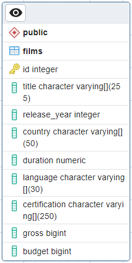

# Intermediate SQL

## Suppose you have a table called films that contains the following fields: [id, title, release_year, country, duration, language, certifications, gross, budget]



### COUNT() function

The COUNT function lets us count something from our table by returning the number of records with a value in a field.

This function doesn't count the null values

Example:

- Count the title of all films

```roomsql
SELECT COUNT(title)
FROM films
```

The field of the output will be named (count)

```roomsql
SELECT COUNT(title) AS count_title
FROM films
```

The field of the output will be named (count_title)

--------------------------------------------------------------------------------------------------

- COUNT multiple fields 

```roomsql
SELECT COUNT(title) as count_tilte, COUNT(language) AS count_language
FROM films
```

--------------------------------------------------------------------------------------------------

- COUNT number of all records in the table

```roomsql
SELECT COUNT(*) as number_of_films
FROM films
```
--------------------------------------------------------------------------------------------------

- What are the languages in the film table: (count the DISTINCT languages)

```roomsql
SELECT COUNT(DISTINCT language) as languages
FROM films
```
--------------------------------------------------------------------------------------------------

### Query execution

```roomsql
SELECT title
FROM films
LIMIT 10;
```

1 - FROM

2 - SELECT

3 - LIMIT

--------------------------------------------------------------------------------------------------

### Best practices for SQL style

#### Case 1 

##### Poor Practice:

```roomsql
select title
from films
limit 10 -- without Semicolon
```

##### Best Practice

```roomsql
SELECT title
FROM films
LIMIT 10;
```

#### Case 2

##### Poor Practice:

```roomsql
SELECT title, language FROM films LIMIT 10;
```

##### Best Practice

```roomsql
SELECT title, language
FROM films
LIMIT 10;
```

