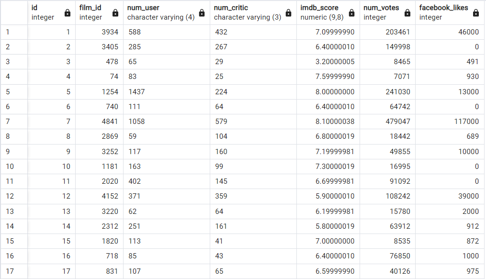
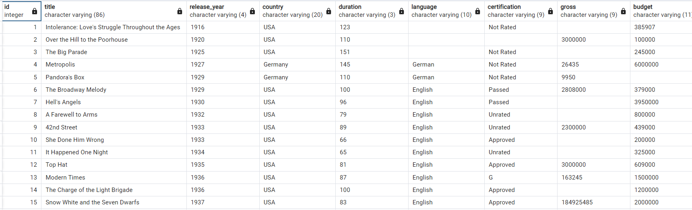

# Intermediate SQL Part 2

To filter, we need to use a new clause called WHERE, which allows us to focus on only the data relevant to our business questions.

```roomsql
SELECT * FROM films
WHERE <Condition>
```

## Filtering numbers

To do this, we will be using comparison operators.

- ```>```  Greater than or a/er
- ```<```  Less than or before
- ```=```  Equal to
- ```>=``` Greater than or equal to
- ```<=``` Less than or equal to
- ```<>``` Not equal to


### Examples:

From ```reviews and films``` Dataset: 





1 - Select film_ids and imdb_score with an imdb_score over 7.0

```roomsql
SELECT film_id, imdb_score
FROM reviews
WHERE imdb_score > 7.0
```

2 - Select film_ids and facebook_likes for ten records with less than 1000 likes 

```roomsql
SELECT film_id, facebook_likes
FROM reviews
WHERE facebook_likes < 1000
LIMIT 10;
```

3 - Count the records with at least 100,000 votes

```roomsql
SELECT COUNT(*) AS films_over_100K_votes
FROM reviews
WHERE num_votes >= 100000;
```

4 - Count the Spanish-language films

```roomsql
SELECT COUNT(*) AS count_spanish
FROM films
WHERE language = 'Spanish'
```

5 - Select the title and release_year for all German-language films released before 2000

```roomsql
SELECT title, release_year
FROM films
WHERE language = 'German'
AND release_year < 2000
```

6 - Update the query to see all German-language films released after 2000

```roomsql
SELECT title, release_year
FROM films
WHERE release_year > 2000
	AND language = 'German';
```

7 - Select all records for German-language films released after 2000 and before 2010

```roomsql
SELECT *
FROM films
WHERE language = 'German'
    AND release_year > 2000
	AND release_year < 2010;
```

8 - Find the title and year of films from the 1990 or 1999

```roomsql
SELECT title, release_year
FROM films
WHERE release_year = 1990
    OR release_year = 1999
```

9 - Select the title and release_year for films released between 1990 and 2000

```roomsql
SELECT title, release_year
FROM films
WHERE release_year BETWEEN 1990 AND 2000
```

10 - Select the names that start with B

```roomsql
SELECT name
FROM people
WHERE name LIKE 'B%'
```

11 - Select the names that have r as the second letter

```roomsql
SELECT name
FROM people
WHERE name LIKE '_r%'
```

12 - Select names that don't start with A

```roomsql
SELECT name
FROM people
WHERE name NOT LIKE 'A%'
```

13 - Find the title and release_year for all films over two hours in length released in 1990 and 2000

```roomsql
SELECT title, release_year
FROM films
WHERE release_year IN (1990, 2000) 
AND duration > 120
```

14 - Find the title and language of all films in English, Spanish, and French

```roomsql
SELECT title, language
FROM films
WHERE language = 'English'
      OR language = 'Spanish'
      OR language = 'French'
```

```roomsql
SELECT title, language
FROM films
WHERE language IN ('English', 'Spanish', 'French') 
```

15 - Find the title, certification, and language all films certified NC-17 or R that are in English, Italian, or Greek

```roomsql
SELECT title, certification, language
FROM films
WHERE certification IN ('NC-17', 'R')
AND language IN ('English', 'Italian', 'Greek') 
```

16:  

- Count the unique titles
- Filter to release_years to between 1990 and 1999
- Filter to English-language films
- Narrow it down to G, PG, and PG-13 certifications

```roomsql
SELECT COUNT(DISTINCT title) AS nineties_english_films_for_teens
FROM films
WHERE release_year BETWEEN 1990 AND 1999
	AND language = 'English'
	AND certification IN ('G', 'PG', 'PG-13');
```

### Missing Values (NULL)

- ```NULL``` values are missing values
- Very common
- ```COUNT(field_name)``` includes only non-missing values.
- ```COUNT(*) includes``` includes missing and non-missing values.
- Use ```IS NULL``` or ```IS NOT NULL``` to:
    * Identify missing values
    * Select missing values
    * Exclude missing values


## Order of execution

```roomsql
-- Written code:
SELECT item
FROM coats
WHERE color = 'green'
LIMIT 5;
```

- The order:
  * FROM coats
  * WHERE color = 'green'
  * SELECT item
  * LIMIT 5;

