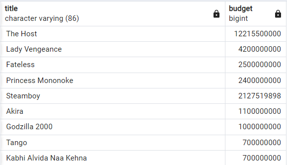

# Intermediate SQL Part 4 : Summarizing sorting.

## Sorting with ```ORDER BY``` keyword

1. [ ] ```ORDER BY``` sorts the result by one or more fields
2. [ ] ```ORDER BY``` sorts the result in ascending order by default or by ```ASC``` keyword after the column.
3. [ ] ```ORDER BY``` sorts the result in descending order by ```DESC``` keyword after the column.
4. [ ] It is a good idea to include the field we are sorting on in the SELECT statement for clarity.
5. [ ] ```ORDER BY``` can also be used to sort on multiple fields. It will sort by the first field specified, 
      then sort by the next, etc. We separate the field names with a comma.

```roomsql
SELECT title, budget
FROM films
ORDER BY budget -- sorting the budget from smallest to biggest
```

OR

```roomsql
SELECT title, budget
FROM films
ORDER BY budget ASC -- More readable
```


```roomsql
SELECT title, budget
FROM films
ORDER BY title ASC -- sorting the titles alphabetically.
```


```roomsql
SELECT title, budget
FROM films
ORDER BY budget DESC
```


OR

```roomsql
SELECT title, budget
FROM films
WHERE budget IS NOT NULL
ORDER BY budget DESC
```



```roomsql
SELECT title, release_year, duration
FROM films
WHERE release_year IS NOT NULL
ORDER BY release_year DESC, duration ASC
```


<hr>

## Order of execution
```roomsql
SELECT title, release_year, duration
FROM films
WHERE release_year IS NOT NULL
ORDER BY release_year DESC, duration ASC
LIMIT 10;
```

* The order is:
1. [ ] FROM
2. [ ] WHERE
3. [ ] SELECT 
4. [ ] ORDER BY
5. [ ] LIMIT