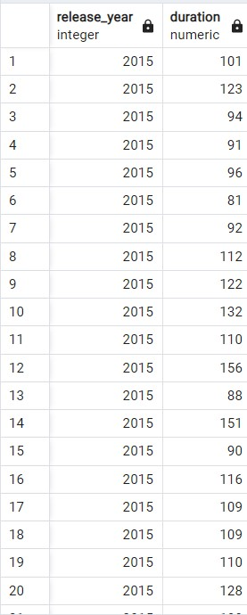
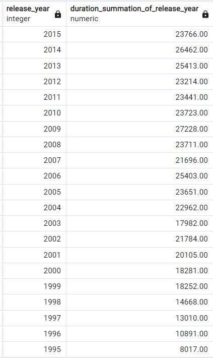
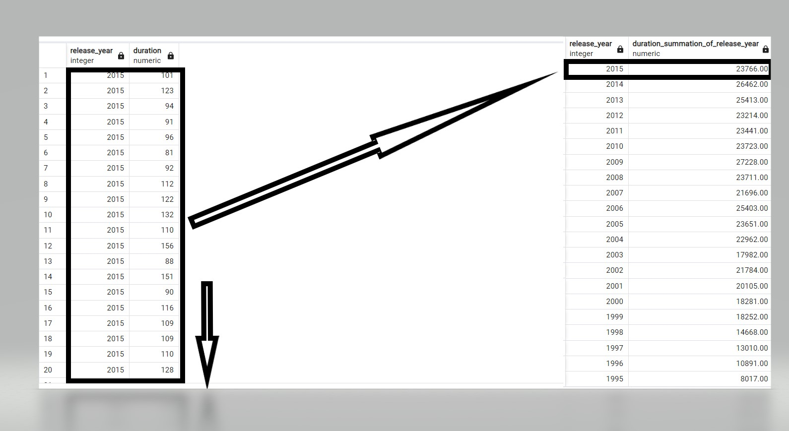
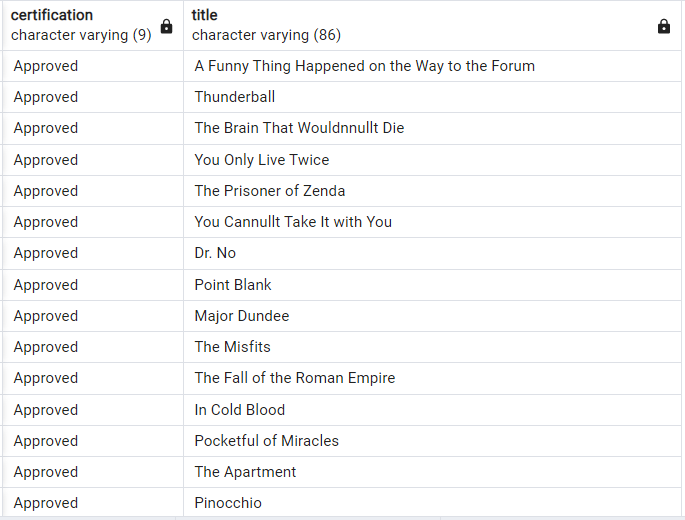
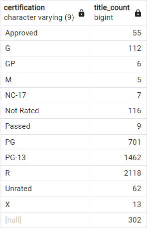
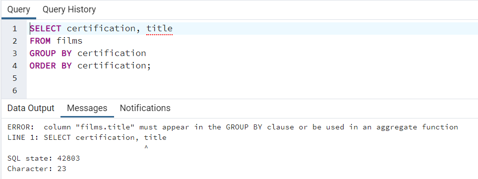
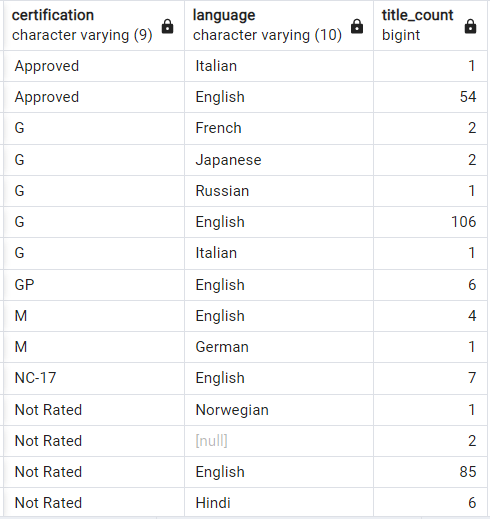
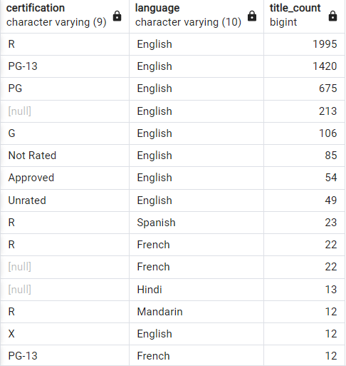

# Intermediate SQL Part 4 : Summarizing grouping.

## grouping with ```GROUP BY``` keyword: we'll often need to summarize data for a particular group of results.

1. [ ] ```GROUP BY```  : is commonly used with aggregate functions to provide summary statistics, particularly when only grouping a single field and selecting multiple fields.

* This is because the aggregate function will reduce the non-grouped field to one record only, which will need to correspond to one group.

- Example 1

* Before Grouping:
```roomsql
SELECT 
	release_year, duration
FROM films
WHERE release_year < 2016
ORDER BY release_year DESC
```



* After Grouping

```roomsql
SELECT 
	release_year, 
	ROUND(SUM(duration), 2) AS duration_summation_of_release_year
FROM films
WHERE release_year < 2016
GROUP BY release_year
ORDER BY release_year DESC
```




<hr>

- Example 2

* Before grouping

```roomsql
SELECT certification, title
FROM films
ORDER BY certification;
```



* After grouping 

```roomsql
SELECT certification, COUNT(title) AS title_count
FROM films
GROUP BY certification
ORDER BY certification;
```




<hr>
<hr>

2. [ ] SQL will return an error if we try to SELECT a field that is not in our GROUP BY clause. 

We'll need to correct this by adding an aggregate function around title.



<hr>
<hr>

3. [ ] GROUP BY multiple fields

* We can use GROUP BY on multiple fields similar to ORDER BY.
* The order in which we write the fields affects how the data is grouped.

```roomsql
SELECT certification, language, COUNT(title) AS title_count
FROM films
GROUP BY certification, language 
ORDER BY certification;
```



- The query here selects and groups certification and language while aggregating the title.
- The title_count of <b> Approved </b> certification in <b>Italian</b> is 1
- The title_count of <b> Approved </b> certification in <b>English</b> is 54
- and so on (summary statistics :) )

<hr>
<hr>

4. [ ] GROUP BY with ORDER BY

- We can combine GROUP BY with ORDER BY to group our results, make a calculation, and then order our results.

```roomsql
SELECT certification, language, COUNT(title) AS title_count
FROM films
GROUP BY certification, language 
ORDER BY title_count DESC;
```



- Notice that we can refer back to the alias within the query (title_count) with ORDER BY. That is because of the order of execution


<hr>
<hr>

5. [ ] Order of Execution

```roomsql
SELECT certification, language, COUNT(title) AS title_count
FROM films
GROUP BY certification, language 
ORDER BY title_count DESC
LIMIT 10;
```

1. FROM
2. GROUP BY
3. SELECTING AND CREATING THE ALIAS
4. ORDER BY
5. LIMIT