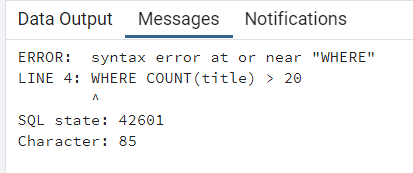
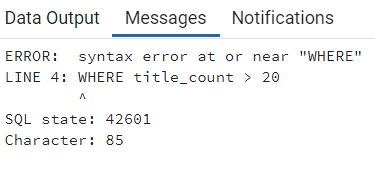
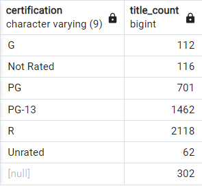
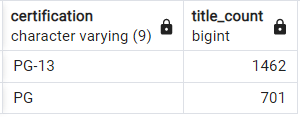
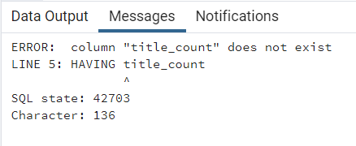
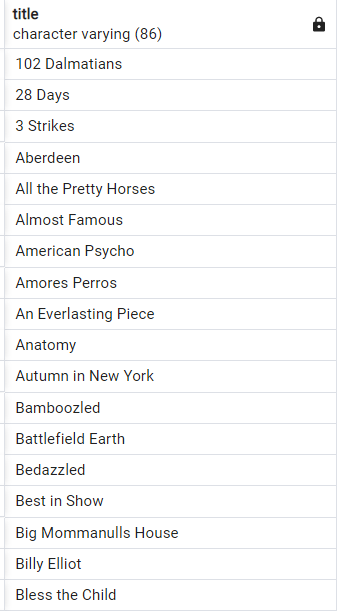
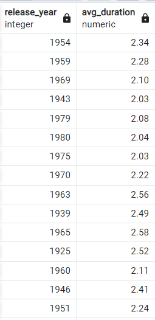

# Intermediate SQL Part 4 : HAVING with GROUP BY (Filtering grouped data)

## In SQL, we can't filter aggregate functions with WHERE clauses.

```roomsql
SELECT certification, COUNT(title) AS title_count
FROM films
GROUP BY certification
WHERE COUNT(title) > 20
ORDER BY certification;
```



```roomsql
SELECT certification, COUNT(title) AS title_count
FROM films
GROUP BY certification
WHERE title_count > 20
ORDER BY certification;
```



### That means that if we want to filter based on the result of an aggregate function, we need another way.

### So, the solution is using HAVING keyword to Filter grouped data

```roomsql
SELECT certification, COUNT(title) AS title_count
FROM films
GROUP BY certification
HAVING COUNT(title) > 60
ORDER BY certification;
```



<hr>
<hr>

### Order of execution

```roomsql
SELECT certification, COUNT(title) AS title_count
FROM films
WHERE certification IN ('G', 'PG', 'PG-13')
GROUP BY certification
HAVING COUNT(title) > 500
ORDER BY title_count DESC
LIMIT 3;
```



- The reason why groups have their own keyword for filtering comes down to the order of execution.
- Order:
1. FROM
2. WHERE
3. GROUP BY
4. HAVING
5. SELECT
6. ORDER BY
7. LIMIT

- By reviewing this order, we can see WHERE is executed before GROUP BY and before any aggregation occurs. 
- This order is also why we cannot use the alias with HAVING, but we can with ORDER BY.

```roomsql
SELECT certification, COUNT(title) AS title_count
FROM films
WHERE certification IN ('G', 'PG', 'PG-13')
GROUP BY certification
HAVING title_count
ORDER BY title_count DESC
LIMIT 3;
```



<hr>
<hr>

### HAVING vs WHERE

1. WHERE filters individual records while HAVING filters grouped records.

- Example 1: What films were released in the year 2000?
- 
```roomsql
SELECT title
FROM films
WHERE release_year = 2000;
```



<hr>

- Example 2: In what years was the average film duration over two hours?

```roomsql
SELECT release_year, ROUND(AVG(duration) / 60, 2) AS Avg_duration
FROM films
GROUP BY release_year
HAVING ROUND(AVG(duration) / 60, 2) > 2
```

